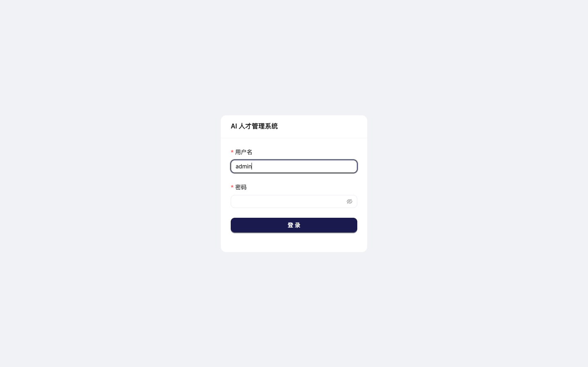
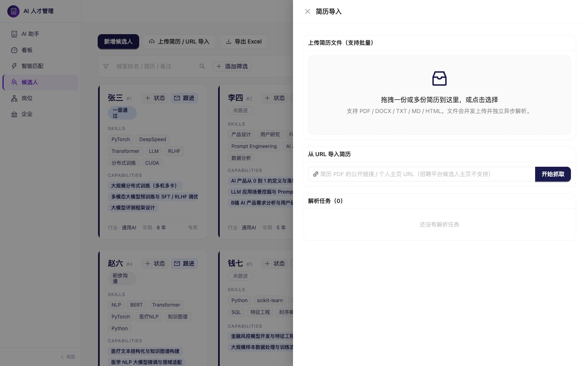
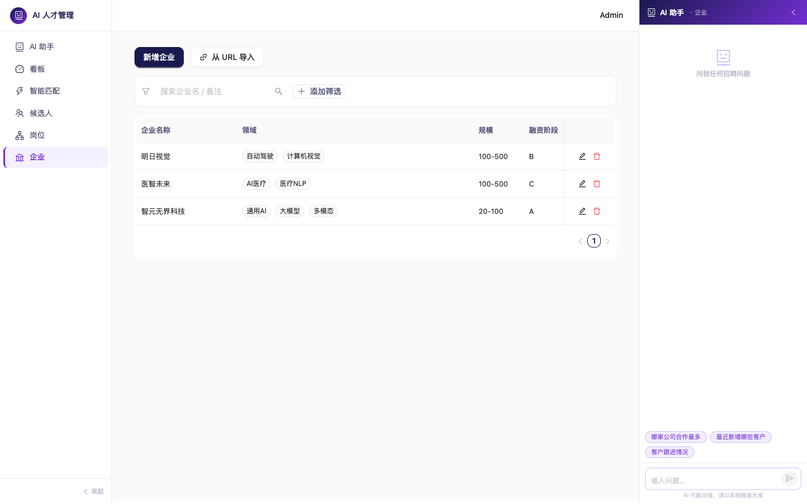
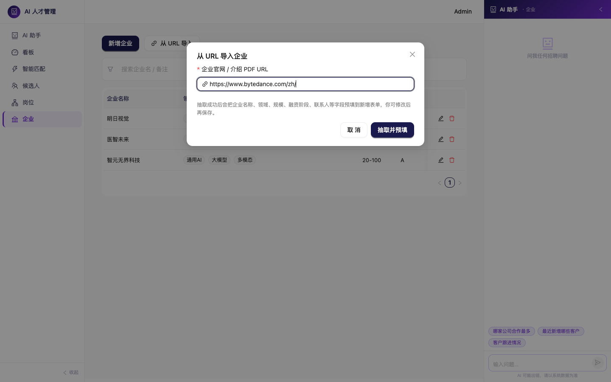
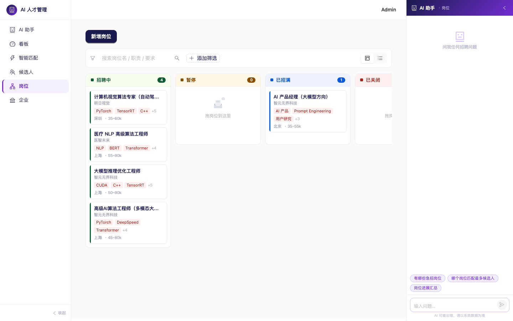
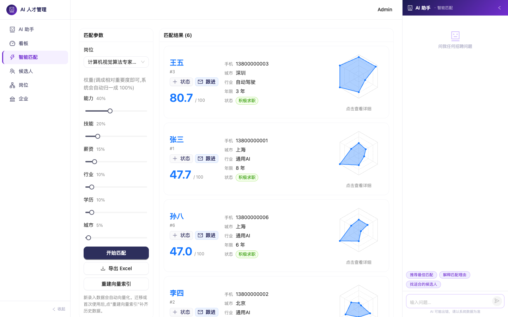

# 快速上手（5 分钟）

面向**第一次打开系统的猎头顾问**。假设环境已经装好、服务已经起来（http://localhost:5173）。

> 完整版说明在 [USER_GUIDE.md](USER_GUIDE.md)，这里只讲最核心的 5 步。

---

## 1 · 登录

打开 http://localhost:5173，用 `admin / admin123` 登录。

---

## 2 · 候选人：拖入简历 PDF

点击顶部菜单 **"候选人"** → 右上角 **"上传简历 / URL 导入"**，把一份或多份简历（PDF / Word / 文本）拖到区域里。

**发生了什么**：后台 GLM 会异步跑 4 步 —— 文本提取 → 结构化抽取 → 能力提炼 → 质量评分，大约 1-2 分钟。任务状态实时刷新。

状态变成"**待确认**"后，点"查看"检查 LLM 解析结果，没问题点"**确认并落库**"，候选人就进库了。

> 也可以粘贴简历 PDF 的公开链接（如个人博客上挂的简历）。**招聘平台主页（BOSS/拉勾）会被拒绝** — 先在平台上点"导出 PDF"再走上传。

---

## 3 · 企业：用 URL 一键导入

切到 **"企业"** 菜单 → 点 **"从 URL 导入"** → 粘贴企业官网 URL（或企业介绍 PDF 链接）→ LLM 自动抽取企业名称、所属领域、规模、融资阶段等字段，**预填到新增表单**，你确认后保存即可。

> **示例**：输入 `https://www.bytedance.com/zh/` → 自动抽出 `字节跳动 / 人工智能·内容平台·社交媒体 / 500+ / IPO`。

---

## 4 · 岗位：填职责，AI 帮你抽能力需求

切到 **"岗位"** → **"新增岗位"** → 选企业 + 写岗位职责、任职要求、必须技能。

**发生了什么**：岗位保存后，后台 GLM 会异步从"职责 + 要求"中**提炼必须能力和加分能力**（`must` / `nice`），几秒到十几秒后，列表页的"能力"列会出现红色/蓝色标签。

**小技巧**：`min_years` 会作为**硬过滤**（候选人不够年限不进召回池）；`max_years` 仅参考。

---

## 5 · 智能匹配：一键找到最合适的人

切到 **"智能匹配"** 菜单 → 左侧选岗位 → 点 **"开始匹配"**。

**看什么**：

- **总分**（0-100）= 能力 ×0.40 + 技能 ×0.20 + 薪资 ×0.15 + 行业 ×0.10 + 学历 ×0.10 + 简历质量 ×0.05
- **各维度彩色条**快速看哪块强哪块弱
- **匹配点（绿）**：为什么这个人合适
- **差异点（红）**：哪些地方有落差，推送客户前要说明

**调权重**：如果你觉得这个岗位"看重能力但不看重行业"，直接改左边的数字，再点"开始匹配"。

---

## 下一步

| 方向 | 去哪里 |
|---|---|
| 1. 环境安装 / 启动服务 | [README.md](README.md) |
| 2. 完整功能说明 | [USER_GUIDE.md](USER_GUIDE.md) |
| 3. 内部技术细节（匹配算法 / 数据模型 / API） | [docs/](docs/) 目录：[03-matching-engine](docs/03-matching-engine.md) · [02-data-model](docs/02-data-model.md) · [01-api-spec](docs/01-api-spec.md) |
| 4. 跑一键演示数据 + 自动化匹配 | `cd backend && python -m app.scripts.seed_demo --wipe && python -m app.scripts.test_matching` |
