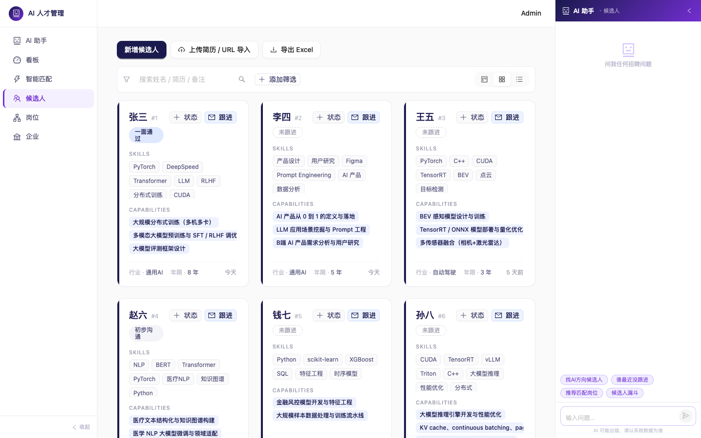

# AI 人才管理系统 · 使用手册

面向 AI 猎头顾问团队的候选人–企业–岗位管理与智能匹配工具。

---

## 目录

1. [登录](#1-登录)
2. [数据看板](#2-数据看板)
3. [候选人管理](#3-候选人管理)
4. [简历导入](#4-简历导入)
5. [跟进与状态管理](#5-跟进与状态管理)
6. [企业管理](#6-企业管理)
7. [岗位管理](#7-岗位管理)
8. [智能匹配](#8-智能匹配)
9. [常见问题](#9-常见问题)

---

## 1. 登录

默认账号：`admin` / `admin123`

登录后 token 有效期 1 小时，前端自动续签，无需重新登录。

> 修改密码的 UI 尚未上线，如需更换密码请联系管理员在后台操作。

---

## 2. 数据看板

> 入口：左侧导航 · 看板


看板回答三个问题：

| 区块 | 内容 |
|---|---|
| **KPI 卡片** | 候选人总数、开放岗位数、合作企业数、近 30 天跟进量，以及与上周同期的涨跌 |
| **推进漏斗** | 各跟进阶段的人数（初步接触 → 推送简历 → 面试 → Offer → 入职），直观看流失节点 |
| **近期活动** | 近 7 天每日跟进次数 + 状态变更次数的折线趋势 |

**右侧 AI 助手**：进入看板后会主动打招呼，提供若干推荐问题（如"本周有哪些逾期跟进？"），点击即可提问，也可自由输入。AI 会结合当前看板数据作答。

**提醒条**：看板顶部会显示"逾期跟进"和"跟进冷却超过 14 天"的候选人名单，点击姓名可直接跳到候选人详情。

---

## 3. 候选人管理

> 入口：左侧导航 · 候选人



### 视图切换

候选人支持三种视图，右上角切换：

| 视图 | 适合场景 |
|---|---|
| **卡片视图**（默认） | 快速浏览候选人概况，封面色表示求职状态 |
| **列表视图** | 多列对比、批量扫描 |
| **看板视图** | 按跟进阶段分栏，拖拽式进度管理 |

视图选择会记住在浏览器，下次打开保持不变。

### 筛选与搜索

筛选栏支持组合使用：

- **求职状态**：积极求职 / 观望中 / 已入职
- **行业**：从已有候选人的行业标签中选
- **技能**：多选，命中任意一项
- **能力**：多选，命中任意一项（LLM 从简历里提炼的真实能力，区别于技能标签）

搜索框按**姓名 / 简历文本 / 备注**模糊匹配，回车或点放大镜触发。

### 候选人状态说明

| 状态 | 含义 |
|---|---|
| **积极求职** | 正在找工作，优先推送 |
| **观望中** | 有兴趣但未主动，可温和推送 |
| **已入职** | 不推送；当跟进状态变为"onboarded"时系统自动切到此状态 |

> 求职状态**由系统根据跟进阶段自动维护**，前端不允许手动直接修改（见第 5 节）。

### 新增候选人（手动录入）

点击"新增候选人"，填写基本信息后保存。适合信息较少、临时记录的场景。手动录入的候选人没有简历质量分，在匹配时按中性分（70 分）参与计算。

**推荐路径**：优先走"简历导入"，信息更完整，系统能自动提炼能力并建立向量索引。

### 导出 Excel

点击"导出 Excel"，当前筛选条件的所有候选人会导出为 `.xlsx` 文件，包含基本信息、技能、能力、状态字段。

### 候选人详情

点击任意候选人（列表行或卡片），右侧滑出详情 Drawer，包含：

- 完整基本信息（可在详情里直接编辑，点"编辑"进入编辑模式）
- 技能标签、LLM 提炼能力列表（每条能力附带来源经历）
- 简历附件链接（PDF 上传后可在此查看）
- **跟进记录 Timeline**（见第 5 节）

---

## 4. 简历导入

> 入口：候选人页面顶部 · "上传简历 / URL 导入"按钮


支持三种方式，可混用：

### 方式 A · 本地文件（推荐）

将 PDF / DOCX / TXT / HTML 文件拖入拖拽区，支持同时拖入多份。每份文件独立处理，互不影响。

### 方式 B · URL 抓取

粘贴公开可访问的 PDF 链接或静态 HTML 页面 URL，点"开始抓取"。适合候选人把简历放在个人主页或公开网盘的情况。

> **注意**：BOSS 直聘、拉勾、猎聘、51job、LinkedIn 等招聘平台的候选人主页**不支持直接抓取**（合规限制）。请让候选人在平台上"导出/下载 PDF"，再走方式 A 上传。

### 解析流程

每份简历提交后在后台独立处理，任务列表会实时更新状态：

```
上传 / 抓取 → 文本提取 → 结构化信息解析 → 能力提炼 → 简历质量评分 → 待确认
```

全程约 60–120 秒（取决于简历长度和本地算力）。

处理完成后状态变为**"待确认"**，点"查看"可看到：

- **基本信息**：姓名、手机、邮箱、城市、年限、学历、技能、期望薪资、工作经历、项目
- **提炼能力**：每条能力附带"来自哪段经历/项目"的证据，便于顾问核实
- **简历质量分**（0–100）：三个子维度——信息详尽度、因果说明、量化实例

确认信息无误后，点**"确认并落库"**，系统才创建候选人档案，并自动建立向量索引（用于后续智能匹配）。

> **解析有误怎么办？** 直接在确认表单里手动修改字段，再落库，不需要重新上传。

---

## 5. 跟进与状态管理

> 入口：候选人卡片右下角 · "跟进" 和 "+ 状态"按钮，或候选人详情 Drawer 内

这是猎头日常用得最多的两个动作。

### 记录一次跟进

点"✉ 跟进"，填写：
- **沟通渠道**：电话 / 微信 / 邮件 / 面谈 / 其他
- **沟通内容**：本次跟进的具体内容
- **下一步计划**（可选）：下次要做什么
- **计划时间**（可选）：作为提醒日期，逾期后会在看板提醒条出现

### 变更跟进阶段

点"+ 状态"，从推进阶段中选择当前进度：

| 阶段 | 说明 |
|---|---|
| 初步接触 | 刚建立联系 |
| 简历已推送 | 候选人简历已发给客户企业 |
| 面试安排中 | 面试时间协调阶段 |
| 面试进行中 | 已开始面试 |
| Offer 已发出 | 企业已发 Offer |
| 已入职 | 候选人已正式入职，**系统自动将求职状态改为"已入职"** |
| 已放弃 | 流程终止 |
| 拒绝 Offer | 候选人拒绝了 Offer，**系统自动将求职状态回滚为"积极求职"** |

### 状态 Timeline

候选人详情 Drawer 底部展示完整的跟进历史 Timeline，包括每次跟进记录和每次阶段变更，按时间倒序排列。

### 卡片的视觉提示

- **卡片封面渐变色**：绿色 = 积极求职，蓝色 = 观望中，灰色 = 已入职（一眼判断候选人当前状态）
- **封面 pill 标签**：显示最近一次跟进阶段

---

## 6. 企业管理

> 入口：左侧导航 · 企业


### 新增企业

两种方式：

**手动录入**：点"新增企业"，填写各字段后保存。

**从 URL 导入（推荐）**：点"从 URL 导入" → 粘贴企业官网 URL 或企业介绍 PDF 链接 → 系统自动抓取并用 LLM 提取企业信息，预填到表单里 → 顾问核对修改后保存。

> 纯动态渲染（需要登录才能看到内容）的页面无法自动抓取，此时改用企业的公开 PDF 介绍文件链接，或手动录入。

### 字段说明

| 字段 | 说明 |
|---|---|
| 所属领域 | 多值标签，如"通用AI / 自动驾驶 / AI医疗"，逗号分隔输入 |
| 规模 | `<20` / `20–100` / `100–500` / `500+` |
| 融资阶段 | seed / A / B / C / D+ / IPO / 自筹 |
| 合作状态 | 潜在 / 合作中 / 暂停 / 已终止 |

### 归档

合作终止或长期暂停的企业可以"归档"，从主列表中隐藏，不影响历史数据。

---

## 7. 岗位管理

> 入口：左侧导航 · 岗位


### 创建岗位

点"新增岗位"，选择关联企业，填写岗位信息。

**重要提示**：岗位职责和任职要求写得越详细，LLM 提炼出的能力需求就越准确，最终匹配质量也越高。建议直接粘贴 JD 原文。

### 能力自动提炼

创建或更新岗位后，系统会在后台（约 10–30 秒）从岗位 JD 中自动提炼出结构化的能力需求列表，区分**必须**和**加分**两类：

- 列表页"能力"列显示前 3 项（红色 = 必须，蓝色 = 加分）
- 刚创建时显示"-"，稍等片刻刷新即可看到
- 这些能力是**智能匹配最关键的输入**，建议创建岗位后检查一遍，有偏差可在详情里手动补充

### 年限与学历

| 字段 | 匹配行为 |
|---|---|
| 最低年限 | **硬过滤**：低于该年限的候选人直接排除，不会出现在匹配结果里 |
| 最高年限 | 仅参考，不过滤 |
| 学历要求 | **软过滤**：学历不足会在学历维度扣分，但不直接排除 |

### 关闭与重开岗位

- **关闭**：岗位填满或暂停招聘时关闭，关闭后不再参与匹配召回
- **重开**：恢复招聘时重开，立即可参与匹配

---

## 8. 智能匹配

> 入口：左侧导航 · 匹配


### 基本流程

1. 从左侧下拉框**选择一个开放岗位**
2. 根据需要**调整维度权重**（可选，默认权重适合大多数场景）
3. 点**"开始匹配"**，系统在约 3–10 秒内返回排序后的候选人列表

### 维度权重

六个维度，权重之和无需恰好为 1（系统自动归一化）：

| 维度 | 默认权重 | 说明 |
|---|---|---|
| **能力** | 0.40 | 候选人从经历中提炼的真实能力 vs 岗位能力需求，语义匹配（同义表述也能命中） |
| **技能** | 0.20 | 候选人技能标签 vs 岗位硬性技能要求，关键词 + 语义双重匹配 |
| **薪资** | 0.15 | 候选人期望区间与岗位薪资区间的重叠率 |
| **行业** | 0.10 | 候选人行业标签和经历 vs 企业所属领域 |
| **学历** | 0.10 | 按学历等级差打分（不够扣分，够则满分） |
| **城市** | 0.05 | 同城或可远程 |

**调权重的常见场景**：

- "这个岗位不看重学历" → 把学历调到 0
- "必须同城，不接受远程" → 把城市调到 0.2
- "这个 JD 写得很细，能力维度很准" → 把能力调到 0.5–0.6

### 匹配结果

每位候选人的卡片显示：

- **总分**（0–100）
- **雷达图**：六维度分布，一眼看出强项和短板
- **各维度分数条**
- **匹配点**（绿色）：候选人在哪些维度命中了岗位要求，以及具体命中了哪些能力/技能
- **差异点**（红色）：哪些要求候选人不满足或薄弱

点候选人姓名可打开其详情 Drawer，在不离开匹配页的情况下查看完整档案，并可直接记录跟进。

### 导出匹配结果

点右上角"导出"，当前匹配结果导出为 Excel 文件，可直接发给客户或存档。

### 重建向量索引

正常情况下，候选人和岗位创建后系统自动建立向量索引。以下情况需要手动重建：

- 系统迁移后首次使用
- 匹配结果为空，但候选人明显应该命中

点匹配页右上角**"重建向量索引"**，系统会在后台重新处理所有现有数据（约 1–3 分钟，进度可从终端日志确认）。重建完成后再点"开始匹配"。

---

## 9. 常见问题

### 匹配结果为空

最常见原因是候选人 / 岗位的向量索引未就绪。系统在以下时机自动向量化，正常情况下不需要手动重建：

- 简历上传成功后
- 手动新建候选人后
- 岗位 LLM 能力提炼完成后

若仍然没有结果，检查：岗位的"能力"列是否还在"-"状态——若是，等 LLM 提炼完成（30 秒内）再匹配。

如果你刚批量导入了大量数据、或切换了 Embedding 服务商，可以让管理员通过后台接口触发一次全量重建：

```bash
curl -X POST https://<backend-host>/api/v1/matches/reindex \
     -H "Authorization: Bearer <admin-jwt>"
```

该接口要求管理员账号；普通用户没有 UI 入口是有意为之，避免误操作。

### 岗位能力列一直是"-"

LLM 提炼是异步任务，通常 10–30 秒完成。若等待超过 2 分钟仍未出现，尝试对该岗位做一次随意的编辑（修改任一字段后保存），触发重新提炼。

### 简历首次上传后系统很慢

第一次触发向量化时，系统需要从网络下载约 2GB 的 Embedding 模型（bge-m3），可能需要 3–10 分钟，取决于网速。下载完成后模型缓存在本地，之后秒级加载。

### 简历 URL 导入提示"抓到的文本过短"

该页面是动态渲染（SPA），服务端无法获取内容。解决方法：让候选人导出 PDF 后走文件上传方式。

### 如何新增顾问账号

用户管理 UI 暂未上线。如需新增账号，请联系管理员在后台手动创建，或参考项目 README 中的脚本说明。

### 删除候选人后能恢复吗

可以。系统使用软删除，数据保留在数据库中。如需恢复，联系管理员通过后台接口恢复。

---

> 系统问题或功能建议，请联系系统管理员。