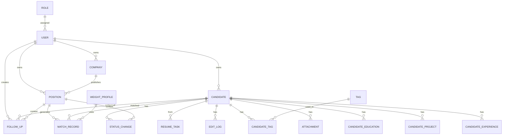

# 数据模型与 ER 图

## 设计原则

- 所有业务表包含 `id, created_at, updated_at, created_by, updated_by`
- 所有"可作废/归档"的表用 `is_deleted BOOLEAN` + `deleted_at` 软删，不物理删除
- 所有主键使用 `BIGINT` 自增（候选人量级可控，不上 UUID 省索引成本）
- JSON 字段统一用 `JSONB`（PostgreSQL）
- 枚举用 PostgreSQL `ENUM` 类型，便于约束 + 索引

---

## ER 图

---

## 表定义

### 认证与权限

**user**
- `id, username(unique), email(unique), password_hash`
- `display_name, avatar_url`
- `role_id FK role.id`
- `is_active, last_login_at`

**role**
- `id, name(unique: admin/consultant), description`
- `permissions JSONB`（`["candidate:read_all", "candidate:write_own", ...]`）

---

### 候选人

**candidate**
- `id, owner_id FK user.id`
- 基础：`name, phone, email, wechat, city, industry, years_of_experience, education_level`
- 状态：`job_status ENUM('active','watching','onboarded')`
- 薪资：`current_salary_min, current_salary_max, expected_salary_min, expected_salary_max`（单位：k/月）
- 技能：`skills TEXT[]`（**声称技能**，简历里明写的，PostgreSQL 数组便于 `ANY()` 查询）
- 能力（提炼）：`derived_capabilities JSONB`（LLM从经历中读出的能力列表，形如 `[{capability, evidence_ref}]`，`evidence_ref` 指向是哪段经历/项目佐证的）
- 简历质量：
  - `resume_quality JSONB`（LLM评分完整输出：`{score, dimensions:{detail,causality,evidence}, overall_comment}`）
  - `resume_quality_score NUMERIC(5,2)`（冗余字段，匹配/排序用）
- 简历：`resume_text TEXT, resume_file_id FK attachment.id, raw_extracted JSONB`（保留LLM原始结构化结果）
- 元数据：`source ENUM('manual','import','self_upload'), notes TEXT`
- 软删：`is_deleted, deleted_at, deleted_reason`
- 索引：`owner_id, job_status, (city,industry), GIN(skills), GIN(to_tsvector(resume_text)), resume_quality_score`

**candidate_experience**（工作经历）
- `id, candidate_id FK, company_name, position_title, start_date, end_date(null=至今), description`
- 排序：按 start_date DESC

**candidate_project**（项目经历）
- `id, candidate_id FK, project_name, role, start_date, end_date, description, tech_stack TEXT[]`

**candidate_education**
- `id, candidate_id FK, school, degree ENUM, major, start_date, end_date`

**tag**
- `id, name(unique), color, category`（category 方便分组，如"岗位类型"、"技能方向"）

**candidate_tag**
- `candidate_id, tag_id`（复合主键）
- 索引：`(tag_id, candidate_id)` 用于按标签查候选人

---

### 企业与岗位

**company**
- `id, owner_id FK user.id`
- `name(unique per owner), industry_tags TEXT[], scale ENUM('<20','20-100','100-500','500+')`
- `funding_stage ENUM('seed','A','B','C','D+','IPO','self')`
- `address, website, contact_name, contact_phone, contact_email`
- `cooperation_status ENUM('potential','active','paused','terminated')`
- `is_archived, archived_at`

**position**
- `id, company_id FK, owner_id FK user.id`
- `title, type`（AI算法/AI产品/数据/工程/其他）
- `responsibilities TEXT, requirements TEXT`
- `required_skills TEXT[], nice_to_have_skills TEXT[]`（**声称类硬技能**）
- `required_capabilities JSONB`（LLM从职责/要求中提炼的能力列表，形如 `[{capability, priority:'must'|'nice'}]`）
- `min_years, max_years`（工作经验区间，**作为硬过滤条件**，不参与打分）
- `salary_min, salary_max`（k/月）
- `city, remote_ok BOOLEAN`
- `headcount INT, benefits TEXT, onboard_deadline DATE`
- `status ENUM('open','paused','closed','filled'), closed_reason`
- `is_template BOOLEAN, template_name`（支持存为模板）
- 索引：`company_id, status, city, GIN(required_skills)`

---

### 跟进

**follow_up**
- `id, candidate_id FK, position_id FK(nullable), user_id FK`（操作人）
- `occurred_at, channel ENUM('phone','wechat','email','in_person','other')`
- `content TEXT, next_plan TEXT, next_plan_due DATE`
- `attachments JSONB`（`[{file_id, filename}]`）
- `is_deleted`

**status_change**
- `id, candidate_id FK, position_id FK(nullable)`
- `from_status, to_status ENUM`（见下方预设）
- `reason TEXT, changed_by FK user.id, changed_at`

**预设跟进状态枚举**：
`initial_contact, resume_pushed, interview_scheduled, interview_1_passed, interview_2_passed, offer_sent, onboarded, rejected_1, rejected_2, declined_offer, dropped`

---

### 审计与附件

**edit_log**
- `id, table_name, record_id, operator_id FK user.id, op ENUM('create','update','delete','restore','transfer')`
- `diff JSONB`（`{field: [old, new]}`）
- `changed_at`
- 索引：`(table_name, record_id, changed_at DESC)`

**attachment**
- `id, uploader_id, filename, storage_path, mime, size_bytes, sha256`
- `owner_type ENUM('candidate','follow_up','company','position'), owner_id`

---

### 简历解析任务

**resume_task**
- `id, user_id FK, file_id FK attachment.id`
- `status ENUM('pending','parsing','extracting','deriving_capabilities','scoring_quality','ready_to_confirm','confirmed','vectorizing','done','failed')`
- `extracted JSONB`（LLM结构化结果：基础字段 + 经历 + 项目）
- `derived_capabilities JSONB`（LLM能力提炼结果）
- `resume_quality JSONB`（LLM简历质量评估结果）
- `candidate_id FK(nullable)`（确认后落库生成的候选人）
- `error_msg, started_at, finished_at`

---

### 匹配

**weight_profile**
- `id, name, owner_id FK user.id`
- `weights JSONB`（`{skill: 0.4, experience: 0.2, salary: 0.15, city: 0.1, education: 0.1, industry: 0.05}`，和为1）
- `is_default BOOLEAN`

**match_record**
- `id, position_id FK, candidate_id FK, weight_profile_id FK`
- `score NUMERIC(5,2)`（0-100）
- `sub_scores JSONB`（各维度分数）
- `matched_points JSONB`（`[{dim, detail}]`）
- `gap_points JSONB`
- `pushed BOOLEAN, pushed_at`
- `created_at`
- 唯一约束：`(position_id, candidate_id, weight_profile_id)`
- 索引：`(position_id, score DESC)`

---

## 向量库（Qdrant）结构

**collection: `candidate_vectors`**
- 每个 candidate_id 一条 point
- 命名向量（均 1024 维，bge-m3）：
  - `skill_vec`（拼接 skills + 项目 tech_stack）
  - `capability_vec`（**新增**：derived_capabilities 列表聚合）
  - `project_vec`（项目描述聚合）
  - `experience_vec`（工作经历描述聚合）
  - `summary_vec`（全简历摘要，兜底召回）
- payload: `{candidate_id, owner_id, city, years, salary_range, is_deleted}`（支持 Qdrant 过滤）

**collection: `position_vectors`**
- 每个 position_id 一条
- 命名向量与候选人对齐：`skill_vec, capability_vec, responsibility_vec, summary_vec`
- payload: `{position_id, company_id, owner_id, status, min_years, max_years}`（min_years/max_years 用于召回阶段反向过滤）
